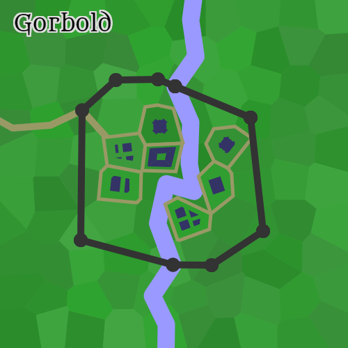

# Gorbold

## Population:
Approximately 41; primarily human, some dwarf.

## Government:
Gorbold is governed by the local priest, a female human named Eryen.

## Description
This small town is located in the woods and looks very old.  It is best-known for the nearby military base and its diverse population.  Also, rumor has it that the inhabitants may not be entirely human.

## Notable Places:
- [The Greedy Trickster](./taverns/The_Greedy_Trickster.md): An elegant elven inn, decorated with monstrous skulls

## Weather

- Description:	Rain
- Temperature:	Moderate
- High:	75°F (23°C)
- Low:	62°F (16°C)
- Relative:	Warmer than normal
- Wind Force:	Moderate
- Wind Speed:	12 mph (19 kph)
- Rain: Rain reduces visibility by half, imposing a -4 penalty on Spot and Search checks. It also imposes a -4 penalty on Listen checks and ranged weapon attacks.

Rain automatically extinguishes candles, torches, and similar unprotected flames. It causes protected flames, such as those of lanterns, to dance wildly and has a 50% chance to extinguish these lights.

Moderate Wind: A steady wind with a 50% chance of extinguishing candles, torches, and similar unprotected flames.