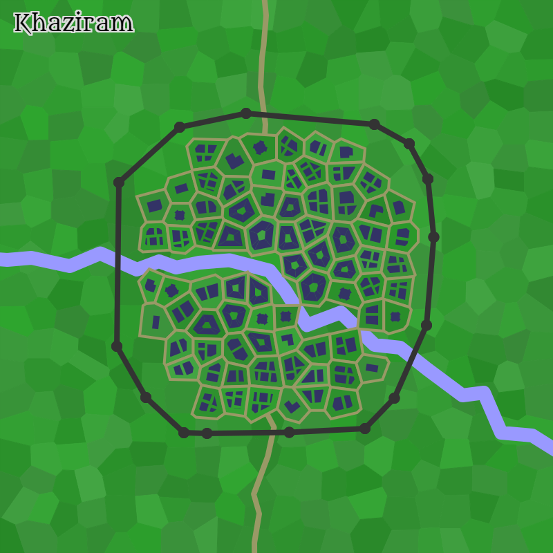

# Khaziram

## Population

Approximately 1100; mixed human and dwarf.

## Government

Khaziram is governed by a consortium of wealthy merchants, known as the [Gray Ministry](./Gray_Ministry.md).

## Notable places

- 1 Cave with waterfall (Boss battle)
- 2 The house of [Fay Cromwell](../../Fay_Cromwell.md)
- 3 Church where [Ella Hillless](../../Ella_Hillless.md) trains
- 4 [Gray Ministry](./Gray_Ministry.md)
- 5 [The Melting Gentlemen](./taverns/The_Melting_Gentlemen.md)
- 6 A statue of crystal, said to entomb the undead corpse of a necromancer. [Althalos Cromwell](../../Althalos_Cromwell.md) father [Geoffrey Cromwell](../../Geoffrey_Cromwell.md)
- 7 [The Lovely Tulip Tavern](./taverns/The_Lovely_Tulip_Tavern.md)
- 8 [Ellaloths Magical Potions](./shops/Ellaloths_Magical_Potions.md)
- 9 [Tani's Sorcerous Armory](./shops/Tanis_Sorcerous_Armory.md)
- 10 [The Fox's Oddities](./shops/The_Foxs_Oddities.md)
- 11 [The Nagas Arsenal](./shops/The_Nagas_Arsenal.md)

## Taverns

- Common - [The Melting Gentlemen](./taverns/The_Melting_Gentlemen.md)
- Good - [The Lovely Tulip Tavern](./taverns/The_Lovely_Tulip_Tavern.md)

## Shops

- Trader - [The Fox's Oddities](./shops/The_Foxs_Oddities.md)
- Weaponsmith - [The Nagas Arsenal](./shops/The_Nagas_Arsenal.md)
- Armorer - [Tani's Sorcerous Armory](./shops/Tanis_Sorcerous_Armory.md)
- Alchemist [Ellaloth's Magical Potions](./shops/Ellaloths_Magical_Potions.md)

## Map

## Weather

- Season: Fall
- Description: Windy
- Temperature: Moderate
- High: 71°F (21°C)
- Low: 57°F (13°C)
- Relative: Normal
- Wind Force: Moderate
- Wind Speed: 11 mph (17 kph)
- Moderate Wind: A steady wind with a 50% chance of extinguishing candles, torches, and similar unprotected flames.

[back](../../story.md)
