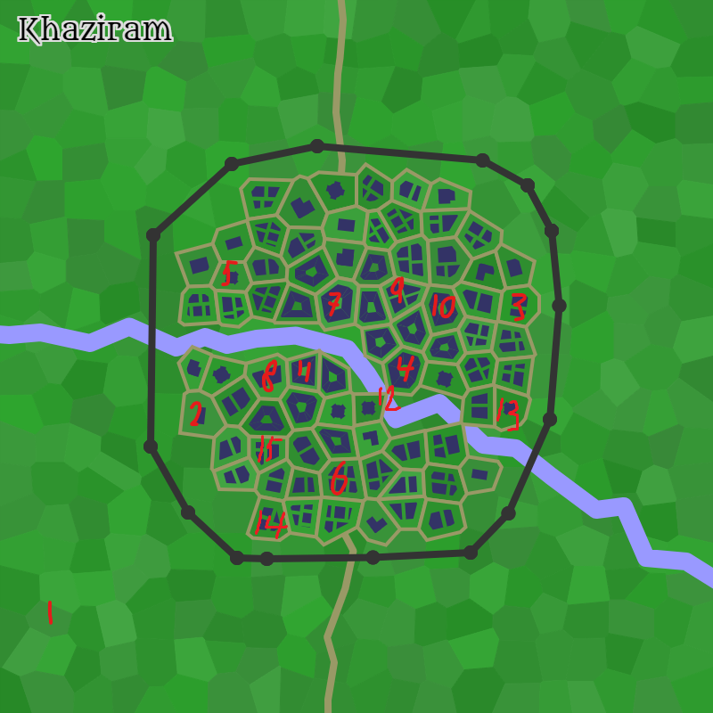

# Khaziram

## Population

Approximately 1100; mixed human and dwarf.

## Government

Khaziram is governed by a consortium of wealthy merchants, known as the [Gray Ministry](./Gray_Ministry.md).

## Description

Forged on the lowest point of a lake, the town of Khaziram is home to people lead by the Gray Ministry.
This town wasn't built by a lake by accident, as it has a dark history, which is of great importance to the people of Khaziram and its success.

The town itself looks sublime. With its ironwood rooftops, oak wood walls and breathtaking waterfall, Khaziram has a mystical atmosphere.
The main attraction is the market, which was built 26 years ago and designed by the Gray Ministry.

Khaziram has a booming economy, which is mainly supported by jewelcrafting, tailoring and smithing. But their biggest strengths are rare animal training and sophisticated cooking.
However, Khaziram lacks people skilled in hunting.

Despite its strengths and weaknesses, Khaziram is most likely headed towards a affluent future under the leadership of the Gray Ministry. But this remains to be seen.

## Notable places

- 1 Cave with waterfall (Boss battle)
- 2 The house of [Fay Cromwell](./npc/main/Fay_Cromwell.md)
- 3 [Chapel](./images/chapel.png) where [Ella Hillless](./npc/main/Ella_Hillless.md) lives
- 4 [Gray Ministry](./Gray_Ministry.md)
- 5 [The Melting Gentlemen](./taverns/The_Melting_Gentlemen.md)
- 6 A statue of crystal, said to entomb the undead corpse of a necromancer. [Althalos Cromwell](./npc/main/Althalos_Cromwell.md) father [Geoffrey Cromwell](./npc/main/Geoffrey_Cromwell.md)
- 7 [The Lovely Tulip Tavern](./taverns/The_Lovely_Tulip_Tavern.md)
- 8 [Ellaloths Magical Potions](./shops/Ellaloths_Magical_Potions.md)
- 9 [Tani's Sorcerous Armory](./shops/Tanis_Sorcerous_Armory.md)
- 10 [The Fox's Oddities](./shops/The_Foxs_Oddities.md)
- 11 [The Nagas Arsenal](./shops/The_Nagas_Arsenal.md)
- 12 Bridge
- 13 Home of [Gamin Bloodgrip](npc/Gamin_Bloodgrip.md)
- 14 Home of [Letholdus Redstream](npc/Letholdus_Redstream.md)
- 15 Guard barracks

## Taverns

- Common - [The Melting Gentlemen](./taverns/The_Melting_Gentlemen.md)
- Good - [The Lovely Tulip Tavern](./taverns/The_Lovely_Tulip_Tavern.md)

## Shops

- Trader - [The Fox's Oddities](./shops/The_Foxs_Oddities.md)
- Weaponsmith - [The Nagas Arsenal](./shops/The_Nagas_Arsenal.md)
- Armorer - [Tani's Sorcerous Armory](./shops/Tanis_Sorcerous_Armory.md)
- Alchemist - [Ellaloth's Magical Potions](./shops/Ellaloths_Magical_Potions.md)

## Map

## Weather

- Description: Windy
- Temperature: Moderate
- High: 71°F (21°C)
- Low: 57°F (13°C)
- Relative: Normal
- Wind Force: Moderate
- Wind Speed: 11 mph (17 kph)
- Moderate Wind: A steady wind with a 50% chance of extinguishing candles, torches, and similar unprotected flames.

[back](../../story.md)
