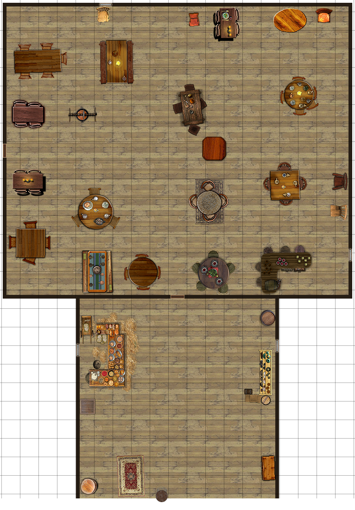
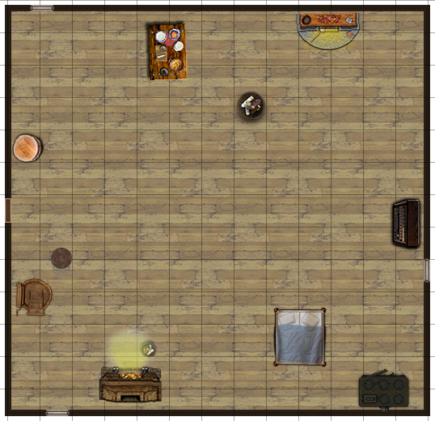

# The Lovely Tulip Tavern - Good Tavern

## Location

On Gold Way, in a university quarter of great libraries and enlightened philosphers. Its neighbors include the office of a male dwarf scribe named Razur and a cloistered traveler's shrine.

## Description

The inn is a two-storey building of half-timbered walls, with a slate roof. A collection of exotic drinking vessels rests upon a long shelf. Accomodations consist of several small rooms with beds and woolen mattresses.

## Owner

The innkeeper is a charming female halfling named Samay Roper. She was once an adventurer, but retired to marry and raise a family.

## Menu

- Steamed Dragon and Dried Apple, Glass of Mead (1 sp)
- Roasted Goose and Onion, Glass of Wine (4 sp)

## Patrons

- [Anen Nhaendrin](../npc/Anen_Nhaendrin.md)

- [Fendrel Rowntree](../npc/Fendrel_Rowntree.md)

- [Hornfinder](../npc/Hornfinder.md)

- [Bertha Chaucer](../npc/Bertha_Chaucer.md)

## Rumors

- Stestead Tower is beseiged by the armies of Mali.
- Dwarven miners have uncovered a terrible secret in the Bearda Downs.
- The wizard Pyrrhea seeks to create an irresistable charm.
- The dragon Biumura has slain a host of adventurers in the Marsh of Corruption.

[back](../Khaziram.md)
