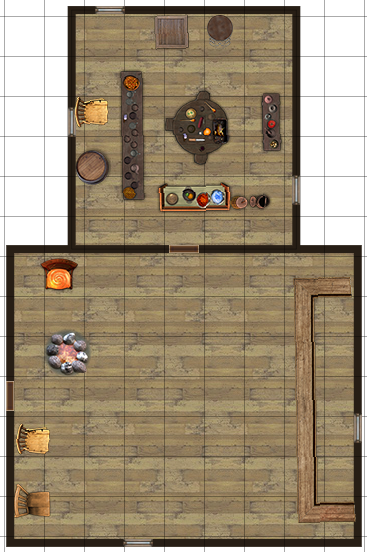
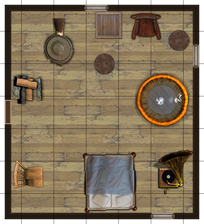

# The Melting Gentlemen - Common Tavern

## Location

In a theater quarter, surrounded by dead-end alleys and makeshift stages. The street outside is strewn with broken tankards and benches.

## Description

The inn is a single storey stone-walled building, with a small fenced yard and well-made wooden tables and chairs. Accomodations consist of wooden cots near the hearth.

## Owner

The innkeeper is a gullible male elf named Genne.

## Menu

- Boiled Eggs and Bitter Cheese, Tankard of Stout (11 cp)
- Boiled Eggs and Dried Turnip, Tankard of Bitter (7 cp)
- Hazelnut Bread and Curd Cheese, Mug of Stout (5 cp)
- Stewed Carrot, Mug of Perry (3 cp)
- Spelt Porridge, Mug of Stout (3 cp)

## Patrons

- [Tiny Chilly](../npc/Tiny_Chilly.md)

- [Ingon Maltanthir](../npc/Ingon_Maltanthir.md)

## Rumors

- A noble djinni is held imprisoned within the Dark Gauntlet of Doom, charmed by a seductive devil.
- Lady Liona has been murdered by a red-robed assassin.
- An ancient sunken city lies somewhere beneath the Rhore Woods.

[back](../Khaziram.md)
